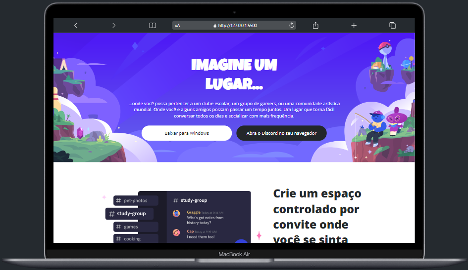

# Clone Discord - Responsivo

Uma página clone do Discord, feito apenas com **_HTML_** e **_CSS_**, também usando um design responsivo para dispositivos móveis e aplicando o conceito de "mobile first".

### Rodando o Projeto

Faça uma cópia/clone do repositório para seu computador, abra no VS Code e rode através da extensão "Live Server".

### Telas do Projeto

### Autor

Rodrigo Duarte
